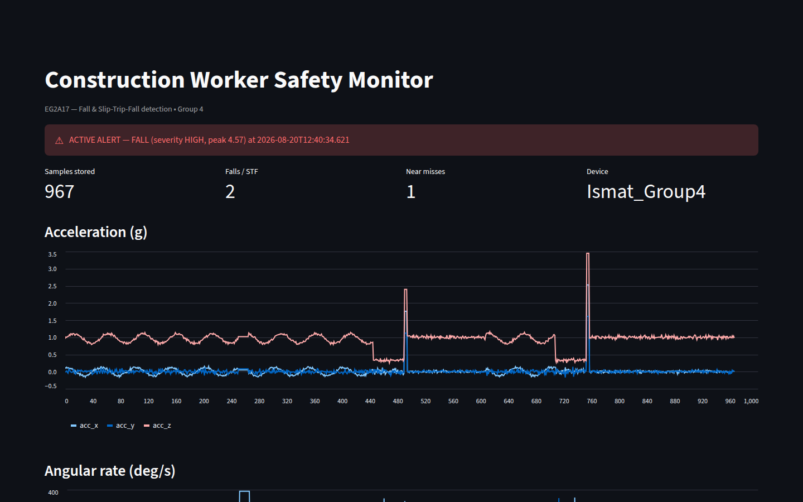

# EG2A17 Data Engineering Project — Pipeline

Full sensor-to-dashboard pipeline for detecting falls, slip-trip-falls (STF),
and near misses from the Arduino Nesso N1.



## Files

| File | Stage | What it does |
|------|-------|--------------|
| `config.py` | — | All settings in one place (UUIDs, DB, thresholds) |
| `storage.py` | storage | Database layer — works with SQLite **or** MariaDB |
| `detector.py` | detection | The fall/STF/near-miss detection engine |
| `nesso_live.py` | **main** | Live: receive BLE → store → detect → alert |
| `process_offline.py` | processing | Reprocess stored data, tune thresholds |
| `dashboard.py` | visualisation | Live web dashboard with charts + alerts |
| `replay_demo.py` | demo | Feed a scripted IMU trace through the real pipeline, no hardware needed |

## Install

```
pip install bleak pandas streamlit
pip install mariadb        # only if using MariaDB
```

## Choose your database (in config.py)

- `DB_BACKEND = "sqlite"` → zero setup, one file. **Use this if MariaDB gives trouble.**
- `DB_BACKEND = "mariadb"` → real server, better for marks.

### MariaDB one-time setup
After installing MariaDB, open the MariaDB shell and run:
```sql
CREATE DATABASE nesso_db;
CREATE USER 'nesso'@'localhost' IDENTIFIED BY 'nesso_pw';
GRANT ALL PRIVILEGES ON nesso_db.* TO 'nesso'@'localhost';
FLUSH PRIVILEGES;
```
Then set the same password in `config.py` under `MARIADB`.

## Run order

1. Upload the Arduino sketch to the Nesso (once). Screen shows "Waiting for BLE connection".
2. **Record + detect live:**  `python nesso_live.py`
3. **Watch the dashboard** (separate terminal):  `streamlit run dashboard.py`
4. Stop recording with Ctrl+C.
5. **(Optional) tune detection:** edit thresholds in `config.py`, then
   `python process_offline.py` to re-run over stored data.

## Tuning the detector

The thresholds in `config.py` (FREEFALL_G, IMPACT_G, etc.) are starting
values from fall-detection research. To tune:
1. Record known events (write down "dropped at 17:12:05", "tripped at 17:13:20").
2. Run `process_offline.py` and compare detected events to your notes.
3. Adjust thresholds, rerun, repeat. Record your final values in the report.

## Demo without the hardware

No Nesso at hand? `python replay_demo.py` streams a scripted 9.5-second
IMU trace (walking, one near miss, one STF, one fall) through the real
`parse_packet -> DataStore -> FallDetector` path, then
`streamlit run dashboard.py` shows the result exactly as a live session
would. Easiest with `DB_BACKEND = "sqlite"` in `config.py`.
